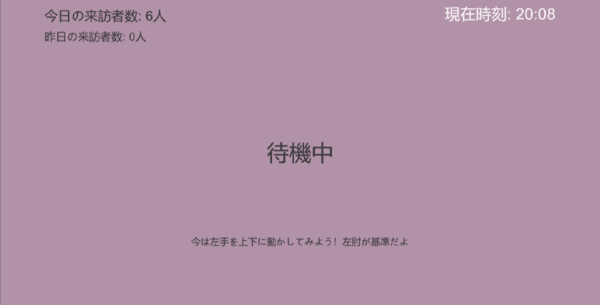
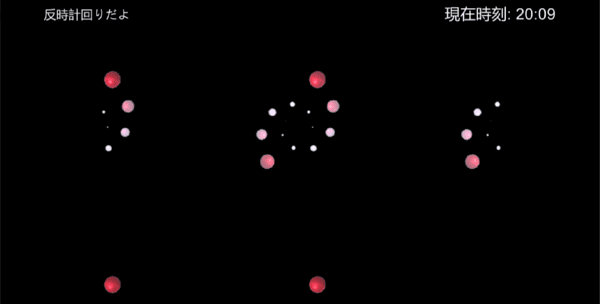
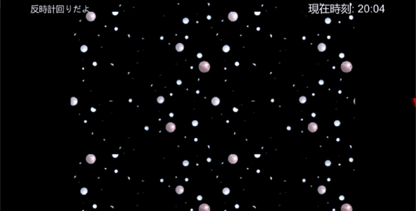
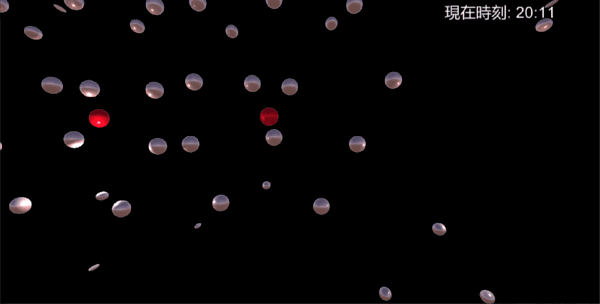
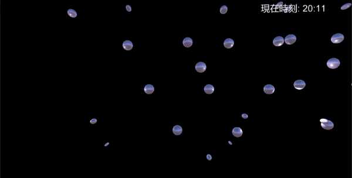
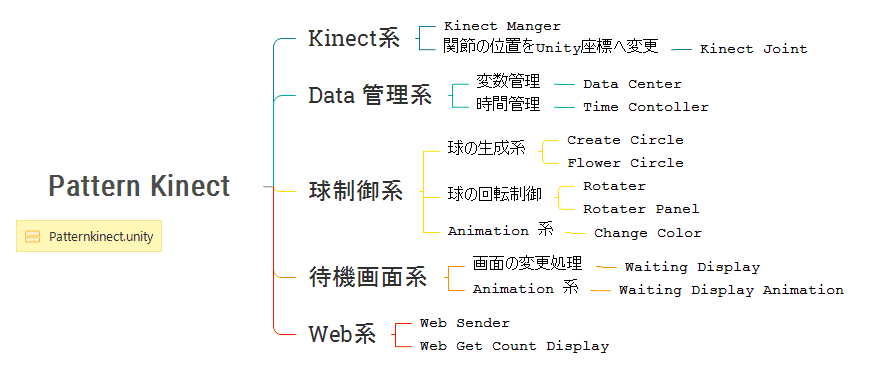
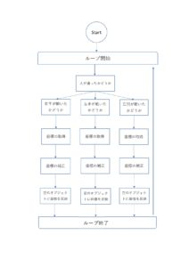

# kinect-unity

## Description

This program was created for a university festival.

In Unity, Draw a pattern using the coordinates acquired by Kinect.  
The pattern is changed by the change of coordinates.

We have tried to make many modes.
The following list is an example of Modes

- When the time is 0 to 20 minutes, the pattern is changed according to the x coordinate of both hands.
- When it is 20 to 60 minutes, the pattern is changed according to the y coordinate of the left hand.
- If Person can't be detected Kinect, you can watch Waiting Display Mode.

## Environment

- Unity 2018.3.7f1
- Kinect v1.8
- Kinect with MS-SDK  

※ For details about WebApi, see [H37kouya/kinect-web-api](https://github.com/H37kouya/kinect-web-api)

## Installation

- [download kinect SDK](https://www.microsoft.com/en-us/download/details.aspx?id=40278)
- [download kinect ms-sdk](https://assetstore.unity.com/packages/tools/kinect-with-ms-sdk-7747)

## Please Check It

There is our blog about this project. If you are interested, look at the link below!

### Toson Blog

[Generative art made with Unity and Kinect: Part 1 (UnityとKinectで作るジェネレーティブアート:Part1)](https://toson.netlify.com/2020/01/08/unity/)

### H37kouya Blog

["I almost touched!" Generative art made with Unity and Kinect:Part2 (「ほぼ触れたよ！」UnityとKinectで作るジェネレーティブアート:Part2)](https://over-hk.net/articles/kinect-unity)

## Details

### Documentation

#### Display Picture

State of Display Mode  

The Pattern by the y coordinate of the left hand  

The pattern by the x coordinate of both hands  

#### PatternKinect Functions Map

#### Joint Name and Number

|  No |  Name | 日本語名 |
|:----|:------|:--------|
|  0  |  Hip_Center  |  お尻|
|  1  |  Spine  | 脊髄(腰) |
|  2  |  Shoulder_Center | 首と肩の間 |
|  3  |  Head  | 頭 |
|  4  |  Shoulder_Left  | 左肩 |
|  5  |  Elbow_Left  | 左ひじ |
|  6  |  Wrist_Left  | 左手首 |
|  7  |  Hand_Left  | 左手 |
|  8  |  Shoulder_Right  | 右肩 |
|  9  |  Elbow_Right  | 右ひじ |
|  10 |  Wrist_Right  | 右手首 |
|  11 |  Hand_Right  | 右手 |
|  12 |  Hip_Left  | お尻(左) |
|  13 |  Knee_Left  | 左ひざ |
|  14 |  Ankle_Left  | 左足首 |
|  15 |  Foot_Left  | 左足 |
|  16 |  Hip_Right  | お尻(右) |
|  17 |  Knee_Right  | 右ひざ |
|  18 |  Ankle_Right  | 右足首 |
|  19 |  Foot_Right  | 右足 |

#### Convert Kinect Coordinates To Unity Coordinates

I'm sorry, This picture uses Japanese.

